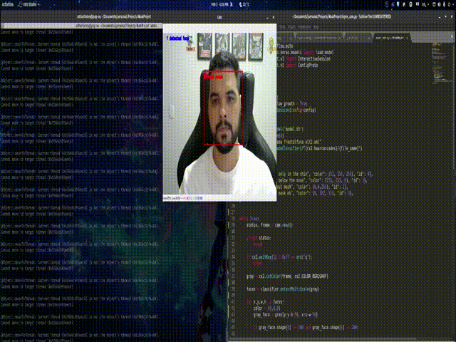

# Personalized Face Mask Detection

A deep learning based on MobileNet architecture to detect whether a person is wearing correctly a mask or not. 


<p align="center">
    
<p/>


## Quick Start and Guide

Visit the [Medium page](https://link.medium.com/060qtr3C43).


## Dataset and Weights

Download the dataset with all images [here](https://drive.google.com/file/d/1QP5Xwgg4WK9OGkzYUr63uGXaGy89nDaA/view?usp=sharing). 

I uploaded the settings and the weights used in this experiments [here](https://drive.google.com/drive/folders/1EonieHcJw5f9YimLOW07LanV1WMvB30g?usp=sharing).

## Usage

```
python open_cam.py
```

## Notes:

- Detections take ~0.5ms per image on CPU.
- The requirements are in requirements.txt (To install: pip install -r requirements.txt)